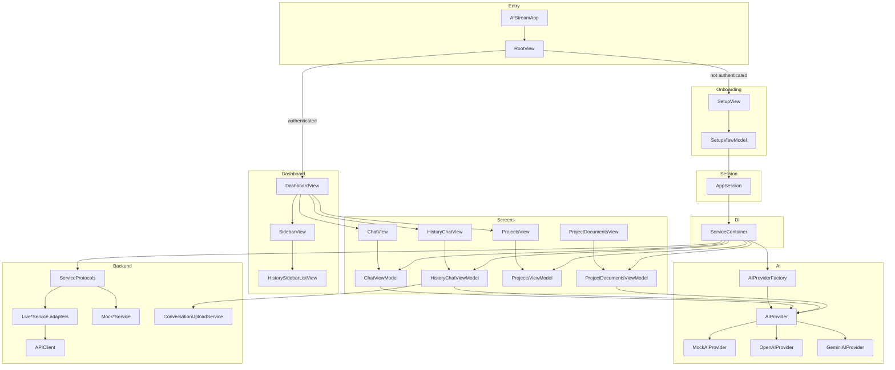
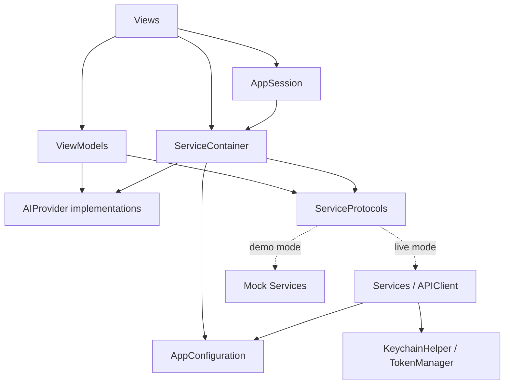
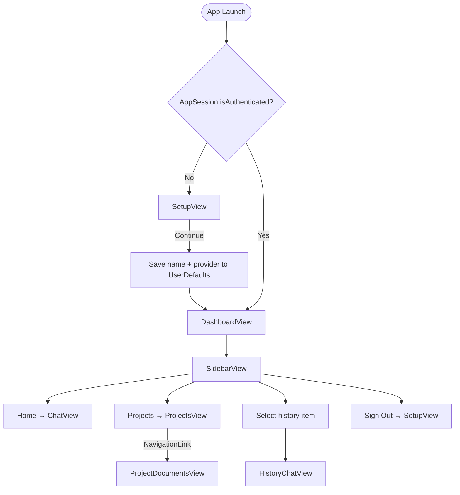
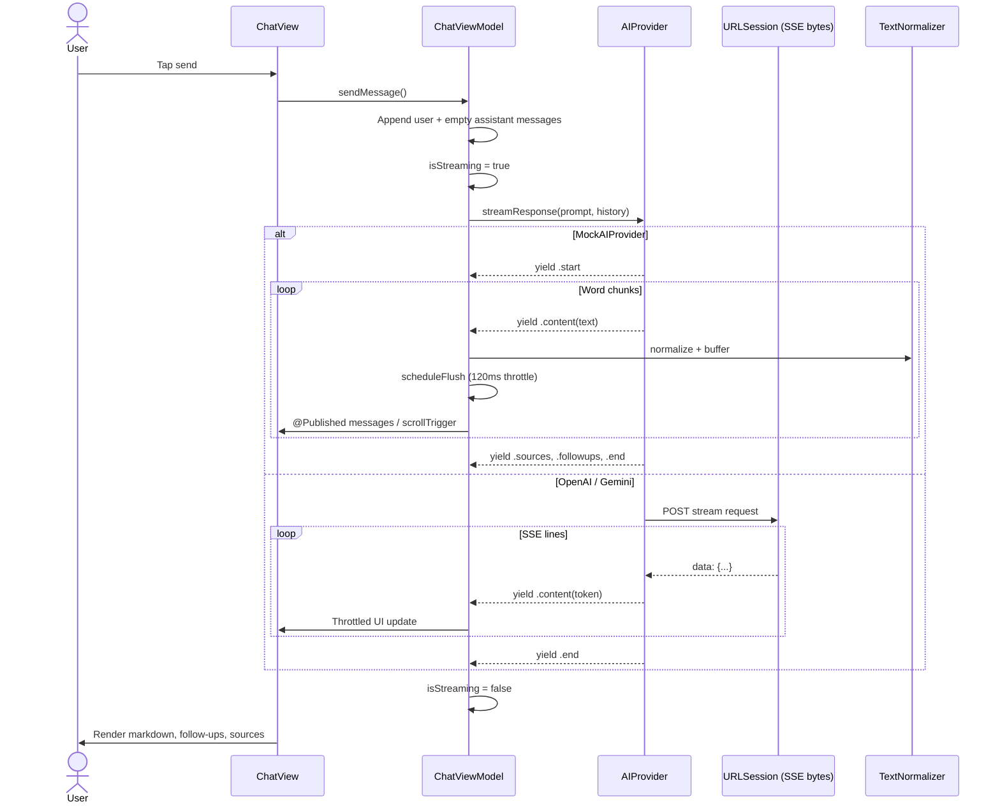

# AIStream

[]()
[]()
[](LICENSE)

A SwiftUI iOS chat application that demonstrates **real-time AI streaming**, **protocol-oriented backend services**, and **pluggable AI providers** (Demo, OpenAI, Google Gemini). The app runs fully offline in demo mode and can optionally connect to a custom REST backend.

<p align="center">
  
  
  
</p>

---

## Overview

AIStream is a single-target iOS app built with SwiftUI. Users complete a lightweight setup flow (display name + AI provider), then interact with a sidebar-driven dashboard:

- **Home** — live streaming chat
- **Projects** — list and create projects; drill into documents
- **Chat History** — browse past conversations and continue them

Streaming responses arrive token-by-token via `AsyncThrowingStream`. The UI renders assistant messages as markdown, supports follow-up question chips, and displays source citations when the provider supplies them.

There is **no repository layer**, **no coordinator layer**, and **no navigation framework** beyond SwiftUI `NavigationStack` and a `SidebarDestination` enum in `DashboardView`.

---

## Features

| Feature | Implementation |
|---------|----------------|
| **Streaming chat** | `ChatView` + `ChatViewModel` + `AIProvider` |
| **Pluggable AI backends** | `MockAIProvider`, `OpenAIProvider`, `GeminiAIProvider` via `AIProviderFactory` |
| **Demo mode (offline)** | Mock AI + in-memory mock services — no API keys required |
| **Conversation history** | Sidebar list + `HistoryChatView` to load and continue threads |
| **Projects** | Fetch/add projects; navigate to `ProjectDocumentsView` |
| **Document upload (mock)** | Simulated multipart upload with job polling |
| **Markdown rendering** | `MarkdownTextView` (UIKit-backed selectable text) |
| **Follow-ups & sources** | `FollowUpSectionView`, `SourcesSectionView` |
| **Adaptive layout** | Persistent sidebar on iPad; slide-over sidebar on iPhone |
| **Secure token storage** | `KeychainHelper` + `TokenManager` (for custom backend auth) |
| **Conversation sync** | `ConversationUploadService` uploads JSON after history chat turns |

### Not wired into the active UI

These files exist in the codebase but are **not** part of the current user flow:

- `LoginView` / `LoginViewModel` / `AuthService` — replaced by `SetupView` + `AppSession`
- `ContentView` — commented-out legacy `TabView`
- `HistoryView` — standalone list view; sidebar uses `HistorySidebarListView` instead
- `StreamingService` — legacy callback-based SSE client for `/chat/stream`
- `ProjectStreamService` — legacy SSE client for `/projects/stream` (project chat uses `AIProvider` today)
- Core Data (`PersistenceController`) — scaffold only; no feature reads/writes entities

---

## Technologies

| Category | Choice |
|----------|--------|
| UI | SwiftUI |
| Architecture | MVVM |
| Reactive state | Combine (`@Published`, `ObservableObject`) |
| Async | Swift Concurrency (`async`/`await`, `Task`, `AsyncThrowingStream`, `URLSession.bytes`) |
| Networking | `URLSession` via `APIClient` (REST) and provider-specific SSE streams |
| DI | Manual — `ServiceContainer` singleton with protocol-typed services |
| Persistence | `UserDefaults` (session), Keychain (tokens), in-memory mocks |
| Config | `Secrets.xcconfig` → `AppSecrets.plist` → `AppConfiguration` |
| Tests | XCTest (scaffold targets; no behavioral tests yet) |

**Requirements:** Xcode 15+, iOS 17+, Swift 5.9+

---

## Folder Structure

```
AIStream/
├── AIStream/                    # Application source (single target)
│   ├── AIStreamApp.swift        # @main entry point
│   ├── Configuration/           # AppConfiguration (reads Info.plist)
│   ├── DI/                      # ServiceContainer
│   ├── Models/                  # ChatMessage, Project, StreamEvent, …
│   ├── Mocks/                   # In-memory service implementations
│   ├── Protocols/               # ServiceProtocols.swift
│   ├── Providers/               # AIProvider + OpenAI / Gemini / Mock
│   ├── Services/                # APIClient, auth, history, upload, SSE
│   ├── Utils/                   # TextNormalizer, HTMLChatParser
│   ├── ViewModels/              # One ViewModel per major screen
│   └── Views/                   # SwiftUI screens and components
├── AIStreamTests/
├── AIStreamUITests/
├── Config/
│   ├── Secrets.example.xcconfig # Template (committed)
│   └── Secrets.xcconfig         # Local secrets (gitignored)
├── Assets/                      # Recommended — screenshots, GIFs, diagrams
│   ├── Screenshots/
│   ├── GIFs/
│   └── Architecture/
├── LICENSE
└── README.md
```

---

## Architecture

The app follows **MVVM** with **protocol-oriented services** and a **central DI container**. Views observe ViewModels; ViewModels call services or AI providers directly.

### Layer responsibilities

| Layer | Purpose | Key types | Depended on by |
|-------|---------|-----------|----------------|
| **Views** | SwiftUI layout, navigation chrome, user input | `RootView`, `DashboardView`, `ChatView`, `SetupView`, … | — |
| **ViewModels** | Screen state, streaming orchestration, error surfacing | `ChatViewModel`, `HistoryChatViewModel`, `ProjectsViewModel`, … | Views |
| **DI** | Wire mock vs live services; factory ViewModels | `ServiceContainer` | Views (via `.shared`) |
| **Session** | Onboarding flag, provider preference, logout | `AppSession` | `RootView`, `SetupViewModel`, `SidebarView` |
| **AI Providers** | Token streaming from external LLM APIs | `AIProvider`, `OpenAIProvider`, `GeminiAIProvider`, `MockAIProvider` | ViewModels |
| **Services** | REST calls, uploads, token refresh | `APIClient`, `HistoryService`, `ProjectsService`, `ConversationUploadService`, … | ViewModels, `ServiceContainer` adapters |
| **Protocols** | Swappable backend contracts | `HistoryServiceProtocol`, `ProjectsServiceProtocol`, … | ViewModels, `ServiceContainer` |
| **Mocks** | Offline demo data + simulated latency | `MockHistoryService`, `MockProjectsService`, … | `ServiceContainer` (demo mode) |
| **Models** | Value types / DTOs | `ChatMessage`, `HistoryItem`, `Project`, `AIStreamChunk` | All layers |
| **Configuration** | Build-time keys from xcconfig | `AppConfiguration` | Providers, `ServiceContainer`, services |
| **Utilities** | Text normalization, markdown helpers | `TextNormalizer`, `MarkdownTextView` | Views, ViewModels |

There are **no Repositories**, **no Managers** (beyond `TokenManager` for auth tokens), and **no Coordinators**.

### Architecture diagram



### Dependency graph



### App flow



### Runtime flow — user taps Send in ChatView



**History chat persistence:** When streaming completes in `HistoryChatViewModel`, `uploadConversationSnapshot()` calls `ConversationServiceProtocol.uploadConversation`, which uses `ConversationUploadService` to POST multipart `conversation.json` (live backend) or updates `MockHistoryService` (demo mode).

---

## Folder Tree

<details>
<summary>Full source tree (click to expand)</summary>

```
AIStream/
├── AIStream/
│   ├── AIStreamApp.swift
│   ├── AppSecrets.plist
│   ├── ContentView.swift              # Legacy (commented out)
│   ├── Persistence.swift              # Core Data scaffold (unused)
│   ├── AIStream.xcdatamodeld/
│   ├── Assets.xcassets/
│   ├── Configuration/
│   │   └── AppConfiguration.swift
│   ├── DI/
│   │   └── ServiceContainer.swift
│   ├── Models/
│   │   ├── ChatMessage.swift
│   │   ├── LoginRequest.swift
│   │   ├── LoginResponse.swift
│   │   ├── Project.swift
│   │   ├── ProjectDocument.swift
│   │   ├── StreamEvent.swift
│   │   └── User.swift
│   ├── Mocks/
│   │   ├── MockConversationService.swift
│   │   ├── MockHistoryService.swift
│   │   ├── MockProjectDocumentsService.swift
│   │   ├── MockProjectsService.swift
│   │   └── MockSettingsService.swift
│   ├── Protocols/
│   │   └── ServiceProtocols.swift
│   ├── Providers/
│   │   ├── AIProvider.swift
│   │   ├── AIProviderFactory.swift
│   │   ├── GeminiAIProvider.swift
│   │   ├── MockAIProvider.swift
│   │   └── OpenAIProvider.swift
│   ├── Services/
│   │   ├── APIClient.swift
│   │   ├── AppSession.swift
│   │   ├── AuthService.swift          # Not in active nav flow
│   │   ├── ConversationUploadPayload.swift
│   │   ├── HistoryService.swift
│   │   ├── KeychainHelper.swift
│   │   ├── ProjectsService.swift
│   │   ├── RefreshTokenService.swift
│   │   ├── SSEParser.swift
│   │   ├── StreamingService.swift     # Legacy SSE (unused in chat VM)
│   │   ├── TokenManager.swift
│   │   ├── UploadResponse.swift
│   │   └── UploadStatus.swift
│   ├── Utils/
│   │   ├── HTMLChatParser.swift
│   │   └── TextNormalizer.swift
│   ├── ViewModels/
│   │   ├── ChatViewModel.swift
│   │   ├── HistoryChatViewModel.swift
│   │   ├── HistoryViewModel.swift
│   │   ├── LoginViewModel.swift
│   │   ├── ProjectDocumentsViewModel.swift
│   │   ├── ProjectsViewModel.swift
│   │   └── SetupViewModel.swift
│   └── Views/
│       ├── AddProjectModal.swift
│       ├── ChatView.swift
│       ├── DashboardView.swift
│       ├── FollowUpSectionView.swift
│       ├── HistoryChatView.swift
│       ├── HistorySidebarListView.swift
│       ├── HistoryView.swift          # Standalone (not in sidebar nav)
│       ├── LoginView.swift            # Not in active nav flow
│       ├── MarkdownTextView.swift
│       ├── ProjectDocumentsView.swift
│       ├── ProjectsView.swift
│       ├── RootView.swift
│       ├── SetupView.swift
│       ├── SidebarConversationRow.swift
│       ├── SidebarView.swift
│       └── SourcesSectionView.swift
├── AIStreamTests/
├── AIStreamUITests/
└── Config/
    ├── Secrets.example.xcconfig
    └── Secrets.xcconfig               # Gitignored — create locally
```

</details>

| Folder | Responsibility |
|--------|----------------|
| `Configuration/` | Reads build-time keys (`AI_PROVIDER`, API keys, base URL) from Info.plist |
| `DI/` | Singleton container; selects mock vs live services; constructs ViewModels |
| `Models/` | Domain and API DTO types |
| `Mocks/` | In-memory services with seeded sample data for demo mode |
| `Protocols/` | Service contracts consumed by ViewModels |
| `Providers/` | AI streaming backends (`AsyncThrowingStream<AIStreamChunk, Error>`) |
| `Services/` | REST networking, auth tokens, uploads, legacy SSE helpers |
| `Utils/` | Streaming text normalization; HTML parser (utility, lightly used) |
| `ViewModels/` | Per-screen state and business orchestration |
| `Views/` | SwiftUI UI including shared `MessageRow` bubble component |

---

## Technical Decisions

### Why MVVM + ServiceContainer?

SwiftUI views stay declarative. ViewModels hold `@Published` state and own `Task` lifetimes for streaming. `ServiceContainer` centralizes the mock/live switch so individual views do not branch on configuration.

### Why Combine?

Combine is used where SwiftUI expects reactive objects: `@Published` properties on `ObservableObject` ViewModels (`ChatViewModel`, `HistoryViewModel`, …) and `AppSession`. There are no Combine publishers for network streams — streaming uses Swift Concurrency instead.

### Where Swift Concurrency is used

| Area | Mechanism |
|------|-----------|
| AI streaming | `AsyncThrowingStream`, `for try await` in ViewModels |
| REST API | `async throws` methods on `APIClient`, services |
| Token refresh | `TokenManager` actor with single-flight refresh |
| UI updates | `@MainActor` ViewModels; `Task { @MainActor in … }` for throttled flushes |
| Upload polling | `Task.sleep` loops in `ProjectDocumentsViewModel` |

### How streaming works

1. ViewModel calls `aiProvider.streamResponse(prompt:history:)`.
2. Provider yields typed `AIStreamChunk` events (`.start`, `.content`, `.sources`, `.followups`, `.end`).
3. `ChatViewModel` / `HistoryChatViewModel` buffer content and flush to `@Published messages` every ~120 ms to limit SwiftUI diff churn.
4. `OpenAIProvider` / `GeminiAIProvider` read SSE via `URLSession.bytes(for:).lines`.
5. `MockAIProvider` simulates word-by-word delays locally.

### How dependency injection works

- `ServiceContainer.shared` is a `@MainActor` singleton.
- Services are stored as `any SomeServiceProtocol`.
- Factory methods (`makeChatViewModel()`, etc.) inject the current `aiProvider` and services.
- Default init in views: `ServiceContainer.shared.makeXViewModel()`.
- `AppSession.completeSetup()` calls `ServiceContainer.shared.updateAIProvider(kind:)`.

Demo mode activates when `AppConfiguration.useMockServices` is true (`apiBaseURL == nil` **or** `aiProvider == .mock`).

### How errors propagate

| Layer | Pattern |
|-------|---------|
| AI providers | Throw or finish stream with `AIProviderError`; ViewModel sets `errorMessage` |
| Services | Typed errors (`HistoryServiceError`, `AuthError`, …) or `URLError` |
| ViewModels | Catch in `Task`, assign `errorMessage`, optionally inline error in empty assistant bubble |
| Views | `.alert` bound to `errorMessage`; retry buttons on history/project screens |
| Auth / 401 | `APIClient` → `TokenManager.refreshIfNeeded` → `AppSession.handleUnauthorized()` |

### How state is managed

| State | Storage |
|-------|---------|
| Setup complete, display name, provider | `UserDefaults` via `AppSession` |
| Access / refresh tokens | Keychain via `KeychainHelper` / `TokenManager` |
| Chat messages (live session) | In-memory in `ChatViewModel` |
| History / projects (demo) | In-memory in mock services |
| Streaming flags, input text | `@Published` on ViewModels |

Core Data is initialized in `AIStreamApp` but **not used** by any feature code path today.

### How configuration is loaded

```
Config/Secrets.xcconfig
        ↓ (Xcode build settings)
AIStream/AppSecrets.plist   ← INFOPLIST_FILE merges these keys
        ↓
AppConfiguration.swift      ← Bundle.main.object(forInfoDictionaryKey:)
        ↓
AIProviderFactory / ServiceContainer / APIClient
```

---

## Setup Guide

### 1. Clone and open

```bash
git clone https://github.com/<your-org>/AIStream.git
cd AIStream
open AIStream.xcodeproj
```

### 2. Create local secrets

```bash
cp Config/Secrets.example.xcconfig Config/Secrets.xcconfig
```

`Config/Secrets.xcconfig` is **gitignored**. Never commit API keys.

### 3. Configure `Secrets.xcconfig`

| Key | Required | Description |
|-----|----------|-------------|
| `AI_PROVIDER` | Yes | `mock` \| `openai` \| `gemini` |
| `OPENAI_API_KEY` | If `openai` | OpenAI API key (no quotes) |
| `GEMINI_API_KEY` | If `gemini` | Google Gemini API key (no quotes) |
| `API_BASE_URL` | Optional | Custom backend base URL; empty = mock backend services |
| `OPENAI_MODEL` | Optional | Default: `gpt-4o-mini` |
| `GEMINI_MODEL` | Optional | Default: `gemini-2.0-flash` |

**Quick start (no keys):**

```
AI_PROVIDER = mock
API_BASE_URL =
```

**OpenAI example:**

```
AI_PROVIDER = openai
OPENAI_API_KEY = sk-...
API_BASE_URL =
```

### 4. `AppSecrets.plist`

Located at `AIStream/AppSecrets.plist`. Maps xcconfig variables into the app Info.plist:

```xml
<key>AI_PROVIDER</key>
<string>$(AI_PROVIDER)</string>
<key>OPENAI_API_KEY</key>
<string>$(OPENAI_API_KEY)</string>
<!-- … -->
```

Read at runtime by `AppConfiguration` — there is no separate `Config.swift` or `Environment.plist`.

### 5. Build and run

Select the **AIStream** scheme, choose a simulator or device, ⌘R.

On first launch you'll see **SetupView**. Enter a display name, choose **Demo (Mock)** or a real provider, and tap **Continue**.

### Custom backend (optional)

Set `API_BASE_URL` to your server. Live adapters call:

| Endpoint | Used by |
|----------|---------|
| `GET /history` | History list |
| `GET /conversations/:id` | Load conversation |
| `POST /conversations/upload` | Save conversation JSON |
| `GET /projects` | Project list |
| `POST /projects` | Create project |
| `POST /refresh` | Token refresh |

Auth tokens are expected in Keychain (see `AuthService` / `LoginView` — login UI is present but not connected to `RootView`). `LiveProjectDocumentsService` currently stubs all methods with `notFound`; use demo mode for project document features.

---

## GitHub Assets

Recommended repository layout for marketing and documentation assets:

```
Assets/
├── Screenshots/
│   ├── setup-light.png
│   ├── setup-dark.png
│   ├── chat-light.png
│   ├── chat-dark.png
│   ├── chat-streaming-light.png
│   ├── sidebar-ipad-light.png
│   ├── sidebar-iphone-dark.png
│   ├── projects-light.png
│   ├── project-documents-light.png
│   └── history-chat-dark.png
├── GIFs/
│   ├── streaming-demo.gif
│   ├── sidebar-navigation.gif
│   └── followups-sources.gif
└── Architecture/
    ├── architecture-overview.png
    ├── dependency-graph.png
    ├── app-flow.png
    └── runtime-sequence.png
```

Reference in README:

```markdown


```

Store rendered Mermaid diagrams in `Assets/Architecture/` for GitHub preview (Mermaid renders in README, but PNG exports improve compatibility on external sites).

---

## Screenshot Guide

### Screens to capture

1. **SetupView** — provider picker, display name field
2. **ChatView** — empty state and mid-stream response
3. **ChatView (complete)** — markdown, follow-ups, sources visible
4. **SidebarView** — Home / Projects / history list (iPad + iPhone)
5. **ProjectsView** — grouped list + Add Project modal
6. **ProjectDocumentsView** — attachments, upload progress, streaming Q&A
7. **HistoryChatView** — loaded prior conversation

### Device sizes

| Use case | Device |
|----------|--------|
| App Store / README hero | iPhone 15 Pro (393×852) or iPhone 15 Pro Max |
| iPad layout | iPad Pro 12.9" (1024×1366) — shows persistent sidebar |
| Compact check | iPhone SE (3rd gen) |

### Light and dark mode

Capture **both** appearances for Setup, Chat, Sidebar, and Projects. Use Xcode **Environment Overrides** → Appearance, or Simulator **Features → Toggle Appearance**.

### GIF workflow

1. Simulator → **File → Record Screen** (or `xcrun simctl io booted recordVideo demo.mov`)
2. Perform: send message → watch stream → tap follow-up
3. Trim in QuickTime; convert: `ffmpeg -i demo.mov -vf "fps=12,scale=480:-1" Assets/GIFs/streaming-demo.gif`
4. Target **≤ 5 MB** for GitHub README load time

### Compression

- PNG screenshots: [ImageOptim](https://imageoptim.com/) or `pngquant`
- GIFs: limit to 480px width, 10–15 fps, ≤ 8 seconds
- Prefer PNG for static UI; GIF/WebM for motion

---

## Development Notes

### Adding a new AI provider

1. Create `YourProvider.swift` conforming to `AIProvider`
2. Add a case to `AppConfiguration.AIProviderKind`
3. Register in `AIProviderFactory.makeProvider`
4. Add API key entry to `Secrets.example.xcconfig` and `AppSecrets.plist`

### Mock vs live services

Controlled in `ServiceContainer.init()`:

```swift
if AppConfiguration.useMockServices {
    // MockHistoryService, MockProjectsService, …
} else {
    // LiveHistoryService, LiveProjectsService, …
}
```

### Legacy SSE clients

`StreamingService` (delegate-based) and `ProjectStreamService` (async bytes) target custom backend SSE endpoints. Current chat ViewModels use `AIProvider` exclusively. Integrate or remove legacy clients when connecting to a backend-specific streaming API.

---

## License

MIT — see [LICENSE](LICENSE).

---

## Author

**Poonam More** — iOS engineer. Built to demonstrate production-style streaming chat architecture in SwiftUI.
